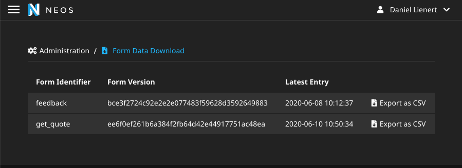
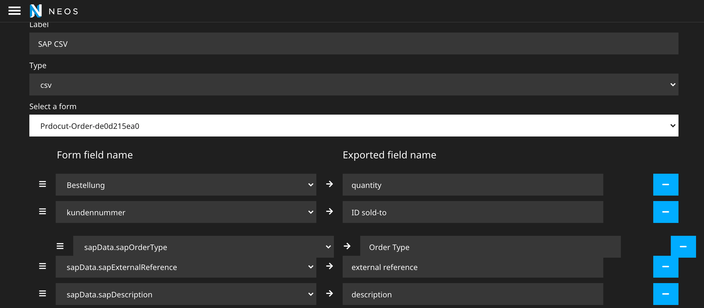

# PunktDe.Form.Persistence

[](https://packagist.org/packages/punktDe/form-persistence) [](https://packagist.org/packages/punktDe/form-persistence) [](https://packagist.org/packages/punktDe/form-persistence)

## Features

* **Persistence finisher** to persist form data into your database. 
* It further provides a **backend module to download** the data in different formats. 
* An **export definition editor** lets you define your custom export definitions.
* Data can be sent in **aggregated via email** regularly
* A **retention policy** can be configured to respect data privacy policies
* **Access to data can be restricted** by sites or content dimension
* Form data is aggregated by the combination of the form identifier and a hash of the form field identifiers to **avoid conflicts when forms change**.




# Installation

```bash
composer require punktde/form-persistence
```

After the successful installation run `./flow doctrine:migrate` to initialize the database table.

# Configuration

## Exclude form types from saving

Some form types are only fro structuring the form or to display static text and should not be available for export. These form types can now be excluded using extendable configuration:

```yaml
PunktDe:
  Form:
    Persistence:
      finisher:
        excludedFormTypes:
          'Neos.Form:StaticText': true
```		  

## Export Definitions

Static export definitions can be defined via settings.

**fileNamePattern**: 

Example: `Form-Export-{formIdentifier}-{currentDate}.csv`

The following variables ca be used: 

* formIdentifier
* formVersionHash
* currentDate
* exportDefinitionIdentifier

## Processor Chain

Processing steps for processing the form data are defined in the `processorChain` configuration. This chain is currently used globally for all exports. You can add your own processors using the postionalArraySprtingSyntax for their positionin the chain.

Example:

```yaml
PunktDe:
  Form:
    Persistence:
      processorChain:
        # My processor
        flattenArray:
          class: 'Vendor\FormProcessors\MyProcessor'
          position: end
```		  	          

## Privileges

Form data may contain sensitive data. The package thus offers priviliges to give backend users individual access. 

### Site Privilege

In a multi-site environment you can restrict the accessibility to form data depending on the site using the `PunktDe\Form\Persistence\Authorization\Privilege\SitePrivilege`. In a `Policy.yaml` add 

```yaml
'PunktDe\Form\Persistence\Authorization\Privilege\SitePrivilege':
  'PunktDe.Form.Persistence:Sites.All':
    label: Access to form data of all sites
    matcher: '*'

'PunktDe.Form.Persistence:Sites.MyFirstSite':
  label: Access to form data of site my-site
  matcher: 'my-site'
```

The matcher accepts, '*', a single name or a comma-separated list of site names.

### Dimension Privilege

In a multi-dimension environment you can restrict the accessibility to form data depending on the content dimension combination using the `PunktDe\Form\Persistence\Authorization\Privilege\SitePrivilege`. In a `Policy.yaml` add

```yaml
'PunktDe\Form\Persistence\Authorization\Privilege\ContentDimensionPrivilege':
  'PunktDe.Form.Persistence:Dimensions.All':
    label: Access to form data of all content dimensions
    matcher: '*'

'PunktDe.Form.Persistence:Dimensions.Germany':
  label: Access to form data of all langues in the german country
  matcher: '{"country": ["deu"]}'
```

The matcher accepts, '*', or a json definition of the dimensions. See `ContentDimensionPrivilegeTargetTest.php` for details.

# Usage
## Add the SaveFormDataFinisher
### Using the flow form configuration

```yaml
type: 'Neos.Form:Form'
identifier: 'my-form'
renderables:
    ...

finishers:
  saveFormData:
    identifier: 'PunktDe.Form.Persistence:SaveFormDataFinisher'
```

### Using the Neos Form Builder
Require the suggested package neos/form-builder and add the save form data finisher to your node based form in the neos backend.

## Scheduled Exports

Exports of your form data can be sent to a specific eMail Address on a regular basis. eMail address and export definition can be configured directly at the finisher.
To trigger the export, the command `formPersistence:sendExport` needs to be called.

## Backend Module

### Download form data

A simple backend module is provided to download the form data as CSV. The form version specifies the used fields and their position. 
With that it is taken care, that if the form changes over time, a separate CSV file with consistent headers and column position is generated. 


### Define Export Definitions

The package brings a graphical editor for defining export definitions. With an export definition you can define the fields together whith the field names which are added to the export.



## Clean up old form data
To clean up old form data entries manually or on a regular basis, one needs to configure the retention period and call the command `formpersistence:cleanupformdata`. 
In the following example a retention period of 30 days is configured and therefore every form data entry older than 30 days ist deleted upon calling the command.

```yaml
PunktDe:
  Form:
    Persistence:
      formDataCleanup:
        retentionPeriod: 'P30D'
```

The whole functionality is encapsulated in a service to allow a better integration into different approaches for regular execution of this functionality for example with a scheduler or queuing work flow.

# Developing the package

## Export Definition Editor

### Working with the react app

To start make changes to the export definition app go to the folder `PunktDe.Form.Persistence/Resources/Public/ExportDefinitionEditorApp`
and run the command

```bash
yarn install
```

After all dependencies are installed, you can adjust the code of the react app. 
The is created with the help of creat-react-app scaffolding tool and therefore uses its build configuration with some adjustments.
To see changes, you need to build the app with the following command.

```bash
yarn build
```

The generated file `main.js` is located in the folder `build/static/js`.
This file is loaded in the Neos Backend and is the editor you see.
